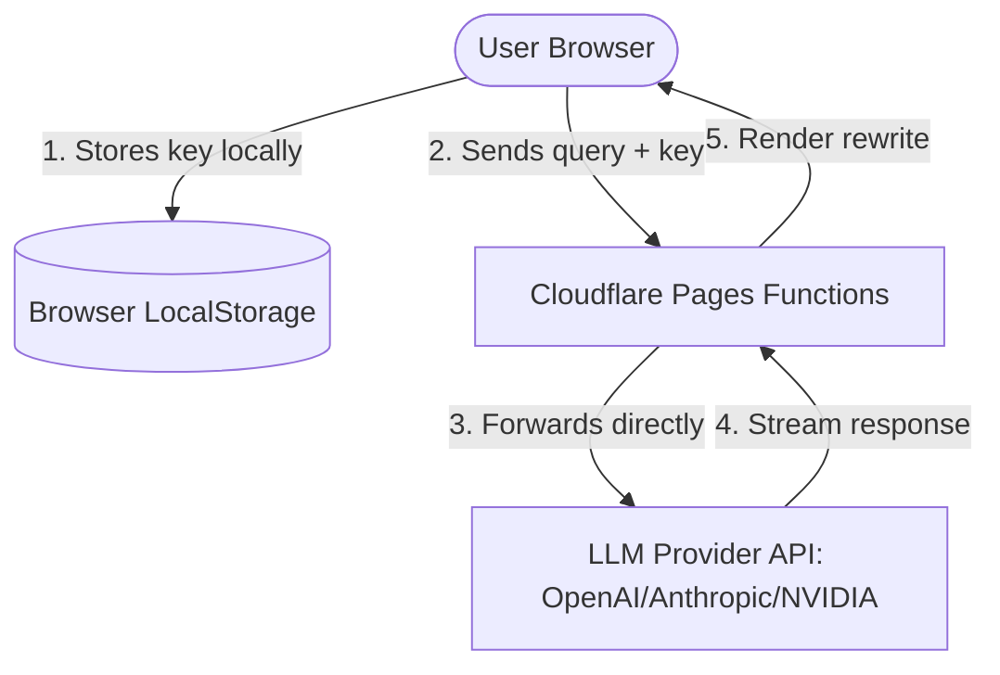

# FAQ & Security Threat Model

## Frequently Asked Questions

### How is my API key stored and handled?
Your API keys are stored only in your browser's local storage (`localStorage`). They are sent directly from your browser to the LLM provider (or via the lightweight Cloudflare Pages API functions when calling endpoints). We **never** store, log, or share your API keys.

### Can I use the app without bringing my own key?
Yes. If the site administrator has configured shared hosted keys, you can select the "Use shared hosted key" option in API Settings. Note that shared keys are rate-limited and subject to daily caps. For production usage or complex prompts, bringing your own key is highly recommended.

### How do variables / placeholders work?
If your raw prompt contains variables like `{{data}}` or bracketed placeholders like `[INSERT QUERY]`, the optimizer will detect them and render them as interactive tags. The UI allows you to input values into a form to compile the final prompt instantly.

---

## Security Threat Model & BYO Key Security

### 1. Client-Side Encryption & Storage
Your API keys are stored in `localStorage` in plaintext. Because they remain sandboxed within the origin domain of this application, they are inaccessible to other websites. 

### 2. Direct Transit
When an optimization request is sent:
- If a custom Base URL is set, the request may bypass our Cloudflare Pages Function and make a direct request to your endpoint (depending on your CORS settings).
- If standard routing is used, our Cloudflare Pages Function receives the key in the request headers and acts as a pure, stateless proxy forwarding the request directly to the provider (OpenAI, Anthropic, OpenRouter, or NVIDIA).
- The Pages Function does **not** write keys to persistent storage, database, or console logs.

### 3. Shared Hosted Keys Option
When utilizing the shared hosted keys provided by the application administrator:
- The keys are kept strictly as encrypted secrets within Cloudflare Pages environment variables.
- These keys are never exposed to the client browser. The client browser only specifies the provider name, and the server function injects the secret server-side before calling the LLM provider.
